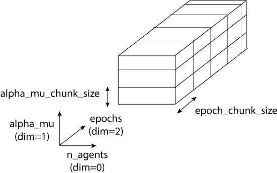

RoohyPy
=======

RoohyPy is a simulator codes and libraries for discrete dynamical systems
built upon dynamical multiplex networks (network consisting of distinct
and multiple layers of interactions between the same set of agents).

RoohyPy implements the matricial representation of the dynamics.

Installation
------------

This simulator requires the following Python packages:

* NetworkX libraries

* numpy libraries for arrays manipulation

* scipy.weave for C codes that accelerate the treatment of 
  large sparse arrays

* bitshuffle and h5py packages for lossless compression algorithm 
  for hdf5 datasets that contain the results of the simulations.

To install the simulator, use the standard setup.py script to install 
a python package:

::

    python setup.py install

Simulator
---------

The simulator takes as input the parameters of the network and simulations
and stores the simulation results in a HDF5 compressed file.

GT-Model (Give and Take Model) simulator
``````````````````
The GT-Model simulator is furnished within the package.
It models the interactions between homogeneous traders that exchange assets
against commodities.

# Add publications...

Sample Python code
:::::::::::
The Python code below simulates a GT-Model with the following 
simulation parameters:

* Number of epochs: 100 iterations
* With :code:`alpha_mu_interval=200`, each parameters :code:`alpha` 
  and :code:`mu` varies
  from [200, 1000[ with the step interval 200 (200, 400, 600, 800).
  1000 is excluded.
* :code:`resultfolder` defines where the results will be stored: './results/'
* The parameters :code:`c0`, :code:`g0` and :code:`p0` are the homogeneous
  initial conditions of each trader.
* :code:`alpha_mu_chunk_size` and :code:`epochs_chunk_size` defines the chunk
  shape of the resulting dataset. The recommended setting is 100 for both
  values.
* For better compression, the real values are stored using unsigned integer
  in 32 bits (:code:`numpy.uint32`).
  The :code:`integer_sensitivity` defines the number of significant digits
  after the decimal point that will be stored in the resulting dataset.
  For instance, with :code:`integer_sensitivity=10000`, the four digits
  after the decimal point are stored in the resulting dataset.
  
The network parameters are:

* :code:`networkfolder` which is the root folder where the network is stored
  in file system.
* :code:`networkname` which is the name of the simulated network.
  This name should correspond exactly to the folder inside
  the :code:`networkfolder`.
  This folder contains two files: nodes.csv and edges.csv files.
  
The structure of nodes.csv file is as follows:
  
::
  
    Nodes Id Label
    0 0 0
    1 1 1
    2 2 2
  
The structure of edges.csv file is as follows:
  
::
  
    Id Source Target
    0 0 2
    1 0 10
    2 0 15
    3 0 17
    4 0 24

The GT-Model simulation code is:

::

    import roohypy.simulators as sim

    # Simulation parameters
    simulation = {}
    simulation['epochs'] = 100
    simulation['alpha_mu_interval'] = 200
    simulation['resultfolder'] = './results/' # With trailing slash
    simulation['c0'] = 300
    simulation['g0'] = 40
    simulation['p0'] = 10
    simulation['alpha_mu_chunk_size'] = 16
    simulation['epochs_chunk_size'] = 100
    simulation['integer_sensitivity'] = 10000

    # Network parameters and
    # set manually some network attributes
    # Here for example, we have an ER with 200 nodes and with p=0.2
    network = {}
    network['networkname'] = 'N200_p0.2_002'
    network['networkfolder'] = './networks/' # With trailing slash

    attributes = {}
    attributes['p'] = 0.2
    attributes['algorithm'] = 'ER'

    # Launch a GT simulation corresponding to the above simulation
    # network and attributes parameters.
    sim.LaunchGTSimulation(simulation, network, attributes=attributes)

Structure of the GT-Model of the resulting dataset
:::::::::::::::::::::::::::::::::::

The filename of the resulting dataset is :code:`dataset.h5` which is stored
inside the folder :code:`resultfolder + networkname + _s'alpha_mu_interval' + _i'epochs'`.

The resulting dataset consists of three subsets.
The first one for assets with :code:`cash` key,
the second one for commodities with :code:`goods` key
and the last one for prices with :code:`price` key.

Each subset has the shape :code:`(n_agents, alpha_mu, epochs)` as
depicted in the following figure:



